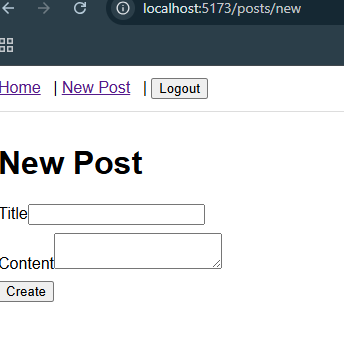
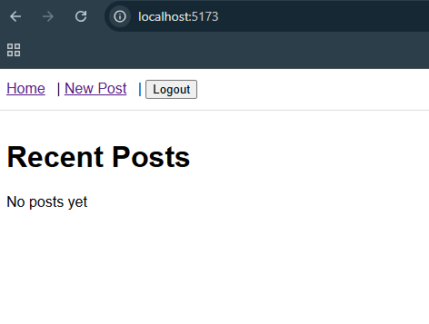

# 📝 MERN Blog Application

A full-stack blog application built with MongoDB, Express.js, React, and Node.js. This project demonstrates seamless integration between front-end and back-end components, featuring user authentication, blog post management, and a responsive user interface.

## 🚀 Features Implemented

### ✅ Authentication & Authorization
- User registration with email validation
- Secure login with JWT tokens
- Password hashing with bcryptjs
- Protected routes and API endpoints
- Automatic token refresh and logout

### ✅ Blog Post Management (CRUD)
- Create new blog posts with title, content, and excerpt
- Read/view all posts with pagination
- Update existing posts
- Delete posts
- View count tracking for each post
- Slug-based URL routing for posts

### ✅ Categories
- Category management
- Associate posts with categories
- Filter posts by category

### ✅ Comments System
- Add comments to blog posts
- Comment author tracking
- Timestamps for comments

### ✅ Image Uploads
- Upload featured images for blog posts
- File storage with multer
- Image serving via static routes

### ✅ Advanced Features
- Server-side validation with express-validator
- Client-side form validation
- Error handling middleware
- Request logging in development mode
- CORS support for cross-origin requests
- Environment configuration management

## 📂 Project Structure

```
mern-stack-integration-jameskim607/
├── client/                          # React frontend
│   ├── src/
│   │   ├── pages/                   # Page components
│   │   │   ├── Home.jsx            # List all posts
│   │   │   ├── PostDetail.jsx      # View single post
│   │   │   ├── NewPost.jsx         # Create new post
│   │   │   ├── Login.jsx           # User login
│   │   │   └── Register.jsx        # User registration
│   │   ├── context/
│   │   │   └── AuthContext.jsx     # Auth state management
│   │   ├── services/
│   │   │   └── api.js              # API service with axios
│   │   ├── App.jsx                 # Main app component
│   │   ├── main.jsx                # Entry point
│   │   └── styles.css              # Global styles
│   ├── index.html                  # HTML template
│   ├── package.json                # Client dependencies
│   └── vite.config.js              # Vite configuration
│
├── server/                          # Express backend
│   ├── models/                      # Mongoose schemas
│   │   ├── User.js                 # User model with auth
│   │   ├── Post.js                 # Blog post model
│   │   └── Category.js             # Category model
│   ├── controllers/                 # Route controllers
│   │   ├── authController.js       # Auth logic
│   │   ├── postController.js       # Post CRUD logic
│   │   └── categoryController.js   # Category logic
│   ├── routes/                      # API routes
│   │   ├── auth.js                 # Auth endpoints
│   │   ├── posts.js                # Post endpoints
│   │   └── categories.js           # Category endpoints
│   ├── middleware/                  # Custom middleware
│   │   ├── auth.js                 # JWT authentication
│   │   └── errorHandler.js         # Error handling
│   ├── uploads/                     # Image upload directory
│   ├── server.js                   # Main server file
│   ├── package.json                # Server dependencies
│   └── .env.example                # Environment template
│
├── README.md                        # This file
├── .gitignore                       # Git ignore rules
└── screenshorts/                    # Application screenshots
```

## 🛠️ Setup Instructions

### Prerequisites
- **Node.js** (v18 or higher)
- **MongoDB** (local installation or MongoDB Atlas account)
- **npm** or **yarn**
- **Git**

### Installation

#### 1. Clone the Repository
```bash
git clone https://github.com/PLP-MERN-Stack-Development/mern-stack-integration-jameskim607.git
cd mern-stack-integration-jameskim607
```

#### 2. Setup Server

```bash
cd server

# Install dependencies
npm install

# Create .env file from example
cp .env.example .env

# Edit .env and add your MongoDB URI and JWT secret
# Example .env:
# MONGODB_URI=mongodb://127.0.0.1:27017/mern_blog
# JWT_SECRET=your_secret_key_here_change_in_production
# PORT=5000
# NODE_ENV=development
```

#### 3. Setup Client

```bash
cd ../client

# Install dependencies
npm install

# Create .env file if needed
# Default API URL: http://localhost:5000/api
# You can override with: VITE_API_URL=your_api_url
```

#### 4. Start Development Servers

**Terminal 1 - Start the Server:**
```bash
cd server
npm run dev
# Server will run on http://localhost:5000
```

**Terminal 2 - Start the Client:**
```bash
cd client
npm run dev
# Client will run on http://localhost:5173
```

#### 5. Access the Application
- Open your browser and go to: `http://localhost:5173`
- Register a new account
- Start creating and managing blog posts!

## 📚 API Documentation

### Base URL
```
http://localhost:5000/api
```

### Authentication Endpoints

#### Register User
```http
POST /auth/register
Content-Type: application/json

{
  "name": "John Doe",
  "email": "john@example.com",
  "password": "password123"
}

Response: 201 Created
{
  "token": "jwt_token_here",
  "user": {
    "id": "user_id",
    "name": "John Doe",
    "email": "john@example.com"
  }
}
```

#### Login User
```http
POST /auth/login
Content-Type: application/json

{
  "email": "john@example.com",
  "password": "password123"
}

Response: 200 OK
{
  "token": "jwt_token_here",
  "user": {
    "id": "user_id",
    "name": "John Doe",
    "email": "john@example.com"
  }
}
```

### Blog Post Endpoints

#### Get All Posts
```http
GET /posts?page=1&limit=10&category=category_id

Response: 200 OK
{
  "posts": [...],
  "page": 1,
  "totalPages": 5,
  "total": 50
}
```

#### Get Single Post
```http
GET /posts/:id
# or by slug
GET /posts/:slug

Response: 200 OK
{
  "_id": "post_id",
  "title": "Post Title",
  "content": "Post content...",
  "excerpt": "Post excerpt",
  "author": { "name": "John Doe", "email": "john@example.com" },
  "category": { "name": "Technology" },
  "tags": ["nodejs", "mongodb"],
  "viewCount": 42,
  "comments": [...]
}
```

#### Create Post
```http
POST /posts
Authorization: Bearer jwt_token
Content-Type: application/json

{
  "title": "My First Post",
  "content": "This is the post content...",
  "excerpt": "A brief excerpt",
  "category": "category_id",
  "tags": ["tag1", "tag2"],
  "isPublished": true
}

Response: 201 Created
```

#### Update Post
```http
PUT /posts/:id
Authorization: Bearer jwt_token
Content-Type: application/json

{
  "title": "Updated Title",
  "content": "Updated content...",
  "isPublished": true
}

Response: 200 OK
```

#### Delete Post
```http
DELETE /posts/:id
Authorization: Bearer jwt_token

Response: 200 OK
{ "success": true }
```

#### Add Comment
```http
POST /posts/:postId/comments
Authorization: Bearer jwt_token
Content-Type: application/json

{
  "content": "Great post!"
}

Response: 201 Created
```

### Category Endpoints

#### Get All Categories
```http
GET /categories

Response: 200 OK
[
  { "_id": "id", "name": "Technology", "slug": "technology" },
  { "_id": "id", "name": "Life", "slug": "life" }
]
```

#### Create Category (Admin only)
```http
POST /categories
Authorization: Bearer jwt_token
Content-Type: application/json

{
  "name": "Travel"
}

Response: 201 Created
```

## 📸 Application Screenshots

### Home Page - Blog Posts Listing


### User Registration


## 🔐 Security Features

- **Password Hashing**: Passwords are hashed using bcryptjs before storage
- **JWT Authentication**: Secure token-based authentication
- **CORS**: Cross-Origin Resource Sharing enabled for safe cross-domain requests
- **Input Validation**: Server-side validation for all inputs using express-validator
- **Error Handling**: Comprehensive error handling middleware
- **Protected Routes**: API endpoints require valid JWT tokens

## 📝 Environment Variables

### Server (.env)
```env
# Database
MONGODB_URI=mongodb://127.0.0.1:27017/mern_blog

# JWT
JWT_SECRET=your_secret_key_change_in_production

# Server
PORT=5000
NODE_ENV=development
```

### Client (.env)
```env
# API URL (optional, defaults to http://localhost:5000/api)
VITE_API_URL=http://localhost:5000/api
```

## 🧪 Testing

### Manual API Testing

Test registration with curl/PowerShell:
```powershell
$body = @{
    name = "Test User"
    email = "test@example.com"
    password = "password123"
} | ConvertTo-Json

Invoke-WebRequest -Uri "http://localhost:5000/api/auth/register" `
  -Method POST `
  -Body $body `
  -ContentType "application/json"
```

### Testing Validation

The application includes both client-side and server-side validation:
- **Name**: Required, non-empty
- **Email**: Required, valid email format
- **Password**: Minimum 6 characters
- **Post Title**: Required, max 100 characters
- **Post Content**: Required

## 🚀 Deployment

### Build for Production

**Client:**
```bash
cd client
npm run build
# Creates optimized build in dist/
```

**Server:**
- Update `.env` with production MongoDB URI
- Use process manager like PM2 or Docker
- Set `NODE_ENV=production`

### Deploy to Hosting

1. **Server**: Deploy to Heroku, Railway, Render, or AWS
2. **Client**: Deploy built files to Vercel, Netlify, or GitHub Pages

## 🐛 Debugging & Troubleshooting

### Common Issues & Solutions

#### Registration Error (400 Bad Request)
- Check all fields are filled correctly
- Email must be valid format
- Password must be 6+ characters
- See `FIX_400_ERROR.md` for detailed guide

#### Connection Issues
- Verify MongoDB is running: `mongod`
- Check `.env` has correct `MONGODB_URI`
- Ensure server is running on port 5000
- Check CORS settings

#### Port Already in Use
```bash
# Kill process on port 5000 (server)
lsof -ti:5000 | xargs kill -9

# Kill process on port 5173 (client)
lsof -ti:5173 | xargs kill -9
```

See `DEBUGGING.md` for more troubleshooting steps.

## 📦 Dependencies

### Server
- **express**: Web framework
- **mongoose**: MongoDB ODM
- **bcryptjs**: Password hashing
- **jsonwebtoken**: JWT authentication
- **multer**: File uploads
- **express-validator**: Input validation
- **cors**: CORS middleware
- **dotenv**: Environment variables

### Client
- **react**: UI library
- **react-router-dom**: Routing
- **axios**: HTTP client
- **vite**: Build tool

## 📄 License

MIT License - feel free to use this project for learning and development.

## 🤝 Contributing

1. Fork the repository
2. Create a feature branch (`git checkout -b feature/amazing-feature`)
3. Commit changes (`git commit -m 'Add amazing feature'`)
4. Push to branch (`git push origin feature/amazing-feature`)
5. Open a Pull Request

## 📞 Support

For issues, questions, or suggestions:
1. Check existing issues on GitHub
2. Review `DEBUGGING.md` for troubleshooting
3. Check error messages in browser console and server terminal
4. Create a new GitHub issue with details

## 🎓 Learning Resources

- [MongoDB Documentation](https://docs.mongodb.com/)
- [Express.js Guide](https://expressjs.com/)
- [React Documentation](https://react.dev/)
- [Node.js Guide](https://nodejs.org/en/docs/)
- [Mongoose Schemas](https://mongoosejs.com/docs/guide.html)
- [JWT Authentication](https://jwt.io/)

---

**Happy Blogging! 🎉**

Built with ❤️ for the MERN Stack Development Course
